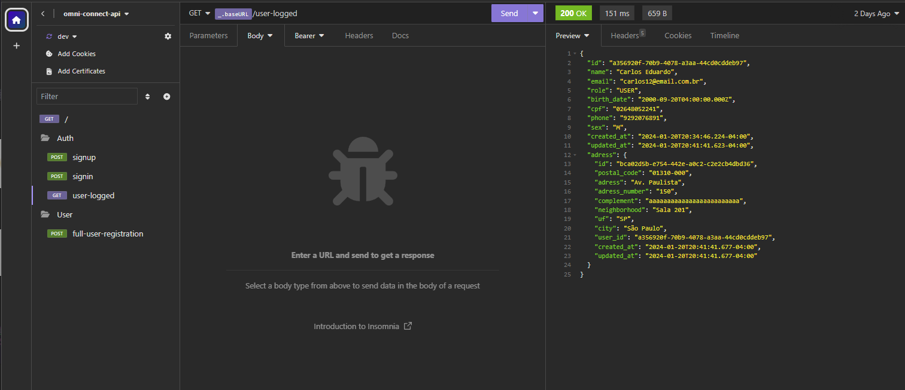

<h1 align="center">
  
</h1>

## 💻 Projeto

Está aplicação foi um desafio técnico para uma vaga de Software Engineer 1.

 O objetivo era desenvolver apenas uma única funcionalidade: a de criação de contas de usuário.
 <br><br>
 A api esta hospedada juntamente com o Banco de dados na **[Render](https://render.com/)**. 
<br>

## 💬 Informações sobre as funcionalidades

### Cadastrar Usuário 🆕

- Existe uma rota de cadastrar usuário.
<br><br>

### Completar perfil 🆕

- Existe uma rota de completar perfil do usuário.
<br><br>

### Exibir dados do usuario 🆕

- Existe uma rota de trazer os dados do usuário salvos no banco de dados. 

### Login ✅

- Existe uma rota de o usuario logar na aplicação..
<br><br>

## 🎲 Executar aplicação Localmente
```bash
# Clone este repositório
$ git clone https://github.com/carlosrossy/omni_connect_api.git

# Entre na pasta do projeto.
$ cd omni_connect_api

# Copiar as envs do projeto
$ copiar o .env.example para o env

# Instale as dependências
$ yarn

# Iniciar os Serviços do Banco de Dados Postgres
$ docker compose up -d

# Executar a migração do Banco de dados
$ node ace migration:run

# Execute a aplicação
$ yarn dev

```

## 🎲 Executar aplicação pelo Insomnia
```bash
# url do projeto
$ https://omni-connect-service.onrender.com

```

## 📄 Documentos
  
- Existe uma pasta com os documentos de Digrama de Arquitetura e de Solução feitos com **[C4 Model](https://c4model.com/)**.
- o link para navegar ate a pasta **[Documents](https://github.com/carlosrossy/omni_connect_api/tree/main/Documents/C4_models)**. 

<br><br>

## 🚀 Tecnologias ultilizadas

- Esta api foi criada com **[NodeJS](https://nodejs.org/en/download/)**.
- Esta api foi criada com **[AdonisJS](https://adonisjs.com/)**.
- Esta api foi criada com a linguagem **[Typescript](https://www.typescriptlang.org/)**.
- O banco de dados ultilizado **[Postgresql](https://www.postgresql.org/)**. 
- Foi ultilizado o para verificar os endpoints **[Insomnia](https://insomnia.rest/download)**.
